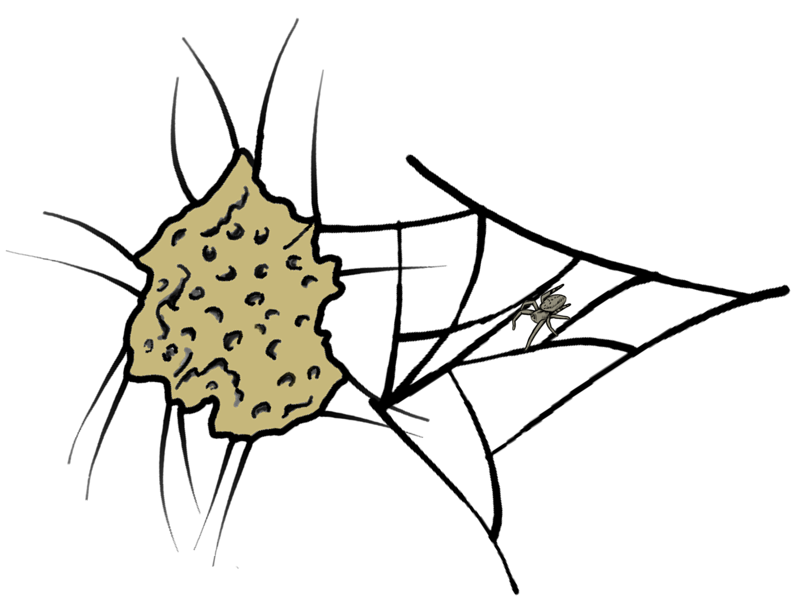

<!-- PROJECT LOGO -->

<p align="center">
  <a href="https://github.com/kjmtaylor22/stegodyve">  </a>
</p>

<!-- ABOUT THE PROJECT -->

## About The Project

This package is not so much an "packaged method" as an analysis protocol wrapped into a package for ease of use. There are some custom functions, but they are built on the functions of standard packages and are mostly for visualization.

The data and protocols included in this package correspond with the article titled *"Spatial and environmental influences on the assembly of silk microbiomes in a social spider."*

In short, the project is an analysis of shared composition between the nest silk of the social spider *Stegodyphus dumicola* and the external environment. Three sample types are collected: retreat (nest) silk, capture web silk, and soil. Both the bacterial and fungal communities associated with each sample type were extracted and sequenced using high-throughput sequencing.

<!-- GETTING STARTED -->

## Getting Started

### Installation

```{r}

devtools::install_github("kjmtaylor22/stegodyve")
```

<!-- USAGE EXAMPLES -->

## Usage

The file `final_analysis_script_revision.Rmd` is an Rmarkdown documenting all of the analyses related to the manuscript, including all exact figure-generating code. It's quite long, so be prepared.

<!-- ACKNOWLEDGMENTS -->

## Acknowledgments

**Authors:** ^1^\*Kara J.M. Taylor, ^1^Steven T. Cassidy, ^2^Peter R. Marting, ^1,3^Mathew A. Leibold, ^1^Carl N. Keiser

**Affiliations:** ^1^Department of Biology, University of Florida, Gainesville, FL 32611; ^2^Department of Biological Sciences, Auburn University, Auburn AL 36849; ^3^Institut Natura e Teoria en Pireneus, Surba, France

**Funding:** This work was funded by University of Florida startup funds to C. N. Keiser, and the National Science Foundation project 2025118 to M. A. Leibold.

<p align="right">

(<a href="#readme-top">back to top</a>)

</p>
